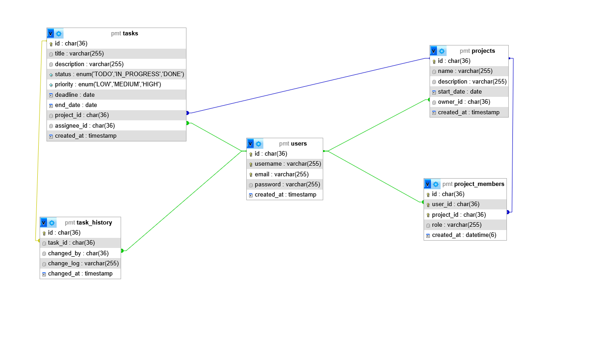
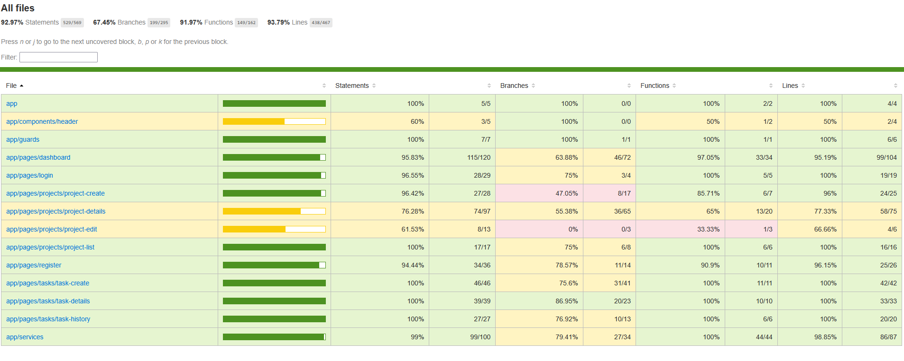
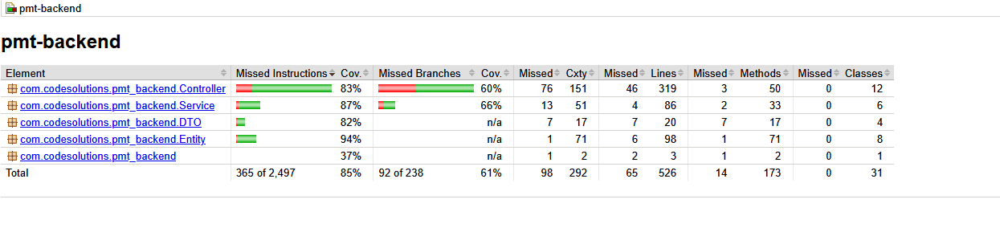

# PMT – Étude de cas (ISCOD)

## 📦 Prérequis

- Docker & Docker Compose
- Git

---

## 🔐 Information importante

Dans le cadre de ce projet pédagogique, le cahier des charges précise qu’**aucune sécurité avancée n’est exigée**.  
Le projet n’a pas vocation à être exposé en production tel quel. En conséquence :
- Les mots de passe de démonstration ne sont **pas chiffrés**.
- L’authentification côté frontend est simplifiée.

Si une mise en ligne était envisagée, les mesures de sécurité usuelles seraient à mettre en place (hash des mots de passe, authentification robuste, durcissement des en-têtes HTTP, etc.).

---

## 🚀 Installation & Démarrage

```bash
# 1) Cloner le dépôt
git clone https://github.com/Twyntz/pmt.git
cd pmt

# 2) Lancer l’environnement (DB + Mailpit + Backend + Frontend)
docker compose up --build
```

- À **la première exécution**, le script `./db-init/schema_pmt.sql` initialise la base avec un schéma et des données de test (utilisateurs, projets, tâches).

---

## 🔗 Accès rapides

- **Base de données (phpMyAdmin)**  
  http://localhost:8000  
  Utilisateur : `root` — Mot de passe : `root`

- **Backend Spring Boot (API)**  
  http://localhost:8080

- **Frontend Angular**  
  http://localhost:4200

- **Mailpit (capture e-mails)**  
  UI : http://localhost:8025 — SMTP : `localhost:1025`

> Les ports & services correspondent à `docker-compose.yml`.

---

## 👥 Comptes de démonstration

Les utilisateurs par défaut sont créés par `db-init/schema_pmt.sql` :

- **alice**  
  Email : `alice@example.com` — Mot de passe : `password123`

- **bob**  
  Email : `bob@example.com` — Mot de passe : `password456`

---

## 🗺️ Schéma de la base

Fichier : `./readme-img/db-schema.png`



---

## ✅ Couverture de code

> Attendu : **≥ 60 %** pour *instructions* et *branches*. Les valeurs ci-dessous sont issues des rapports fournis.

### Frontend (Angular)
- **Statements** : ~93 %  
- **Branches** : ~67 %  

Rapport : `./readme-img/coverage-frontend.png`  


### Backend (Spring Boot – JaCoCo)
- **Instructions** : ~85 %  
- **Branches** : ~61 %  

Rapport : `./readme-img/coverage-backend.png`  


---

## 🧪 Lancer les tests localement

### Frontend
Depuis `pmt-frontend/` :
```bash
npm ci
npx ng test --watch=false --code-coverage
# Rapport HTML : pmt-frontend/coverage/index.html
```

### Backend
Depuis la racine du repo :
```bash
docker run --rm -v "${PWD}:/app" -w /app/pmt-backend   -e SPRING_PROFILES_ACTIVE=test   maven:3.9.6-eclipse-temurin-17 mvn -B clean verify
# Rapport HTML : pmt-backend/target/site/jacoco/index.html
```

---

## 🔁 CI/CD (GitHub Actions)

Une pipeline **CI/CD** est déclenchée sur chaque **push** / **pull request** vers la branche `master`.

Fichier : `.github/workflows/ci-cd-compose.yml`

### Ce que fait la pipeline
1. **Build** de l’environnement via `docker compose`.
2. **Tests** frontend (Angular) et backend (Maven/JaCoCo) en conteneurs.
3. **Publication des rapports** de couverture comme artefacts.
4. **Build & Push** des images Docker **frontend** et **backend** sur **Docker Hub** avec les tags :
   - `latest`
   - `${{ github.sha }}`

### Secrets à configurer dans GitHub
Dans **Settings → Secrets and variables → Actions** :
- `DOCKERHUB_USERNAME`
- `DOCKERHUB_TOKEN` (Access Token Docker Hub)

### Images Docker Hub (exemple)
- Frontend : `https://hub.docker.com/r/twyntz/pmt-frontend:latest`
- Backend : `https://hub.docker.com/r/twyntz/pmt-backend:latest`

---

## 🧾 Récapitulatif des livrables

**Conception**
- Schéma BDD : `readme-img/db-schema.jpg`
- Script SQL : `db-init/schema_pmt.sql`

**Développement**
- Dépôt Git à jour : https://github.com/Twyntz/pmt

**Tests & déploiements**
- Fichier pipeline CI/CD : `.github/workflows/ci-cd-compose.yml`
- Dockerfile backend : `pmt-backend/Dockerfile`
- Dockerfile frontend : `pmt-frontend/Dockerfile`
- Procédure de déploiement : ce `README.md`
- Rapports de couverture (captures) : `readme-img/coverage-frontend.png`, `readme-img/coverage-backend.png`
- Fichier README.md avec la procédure de déploiement : Ce fichier README
